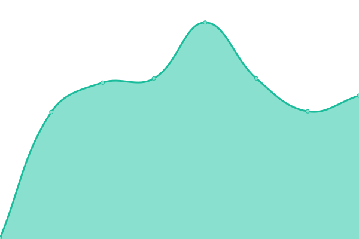
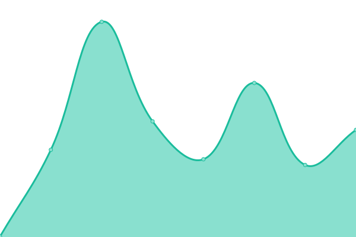
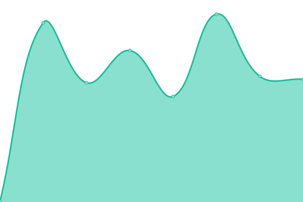
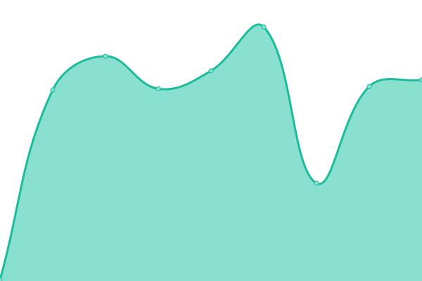

# [📈 Live Status](https://nautical-commerce.github.io/statuspage): <!--live status--> **🟧 Partial outage**

This repository contains the open-source uptime monitor and status page for [Nautical Commerce](https://nauticalcommerce.com), powered by [Upptime](https://github.com/upptime/upptime).

With [Upptime](https://upptime.js.org), you can get your own unlimited and free uptime monitor and status page, powered entirely by a GitHub repository. We use [Issues](https://github.com/nautical-commerce/statuspage/issues) as incident reports, [Actions](https://github.com/nautical-commerce/statuspage/actions) as uptime monitors, and [Pages](https://nautical-commerce.github.io/statuspage) for the status page.

<!--start: status pages-->
<!-- This summary is generated by Upptime (https://github.com/upptime/upptime) -->
<!-- Do not edit this manually, your changes will be overwritten -->
<!-- prettier-ignore -->
| URL | Status | History | Response Time | Uptime |
| --- | ------ | ------- | ------------- | ------ |
|  [Website](https://www.nauticalcommerce.com) | 🟩 Up | [website.yml](https://github.com/Nautical-Commerce/statuspage/commits/HEAD/history/website.yml) | 

 267ms
     
 | 

<a href="https://status.nauticalcommerce.com/history/website">100.00%</a>
    

|  [Nautical Guide](https://guide.nauticalcommerce.com) | 🟩 Up | [nautical-guide.yml](https://github.com/Nautical-Commerce/statuspage/commits/HEAD/history/nautical-guide.yml) | 

 193ms
     
 | 

<a href="https://status.nauticalcommerce.com/history/nautical-guide">100.00%</a>
    

|  [Hosted Checkout](https://checkout.nauticalcommerce.com/version) | 🟩 Up | [hosted-checkout.yml](https://github.com/Nautical-Commerce/statuspage/commits/HEAD/history/hosted-checkout.yml) | 

 159ms
     
 | 

<a href="https://status.nauticalcommerce.com/history/hosted-checkout">100.00%</a>
    

|  [Data Ingestion API](https://ingestion-api.nauticalcommerce.com/) | 🟥 Down | [data-ingestion-api.yml](https://github.com/Nautical-Commerce/statuspage/commits/HEAD/history/data-ingestion-api.yml) | 

 0ms
     
 | 

<a href="https://status.nauticalcommerce.com/history/data-ingestion-api">0.00%</a>
    

<!--end: status pages-->

[**Visit our status website →**](https://nautical-commerce.github.io/statuspage)

## 📄 License

- Powered by: [Upptime](https://github.com/upptime/upptime)
- Code: [MIT](./LICENSE) © [Anand Chowdhary](https://anandchowdhary.com), supported by [Pabio](https://pabio.com)
- Data in the `./history` directory: [Open Database License](https://opendatacommons.org/licenses/odbl/1-0/)
